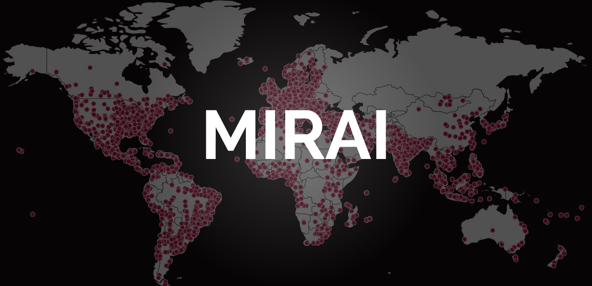

## Mirai

Mirai is a malware that turns networked devices running Linux into remotely controlled bots that can be used as part of a botnet in large-scale network attacks. Mirai is a type of malware that targets consumer devices like smart cameras and home routers, turning them into a zombie network of remote controlled bots. Mirai botnets are used by cybercriminals to target computer systems in massive distributed denial of service (DDoS) attacks. The Mirai botnet was first found in August 2016 by MalwareMustDie, a white hat malware research group, and has been used in some of the largest and most disruptive distributed denial of service (DDoS) attacks, including an attack on 20 September 2016 on computer security journalist Brian Krebs' web site, an attack on French web host OVH, and the October 2016 Dyn cyberattack. Mirai was named after the 2011 TV anime series Mirai Nikki.

## Infection
First, Mirai malware scans IP addresses to identify smart devices running a version of Linux known as ARC. Then, Mirai exploits security vulnerabilities in the IoT device to gain network access via default username and password combinations. If these settings haven’t been changed or updated, Mirai can log in to the device and infect it with malware.

As the number of devices caught in the infected network mount, the cybercriminals in control then use the Mirai botnets to crash targeted websites or servers by bombarding it with more traffic that it can handle. The site or service will remain inaccessible to normal users until the DDoS attack is resolved, which increasingly involves the payment of a ransom.
